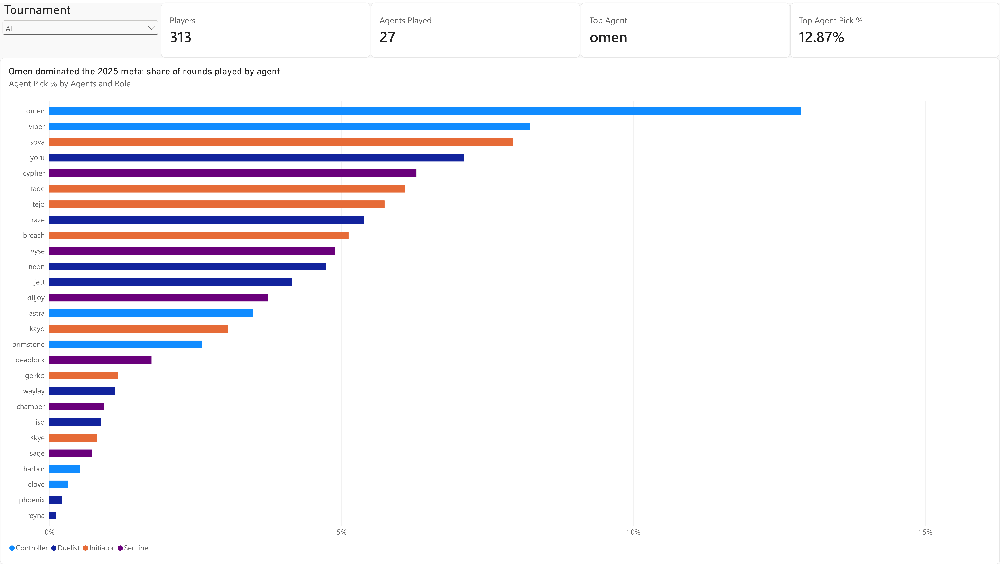
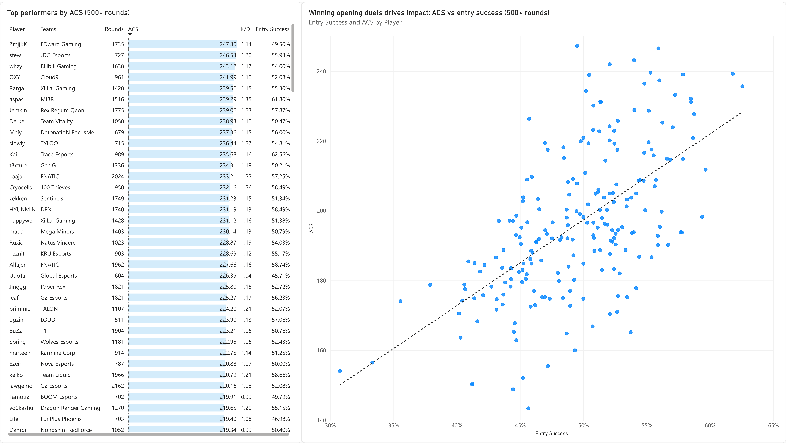
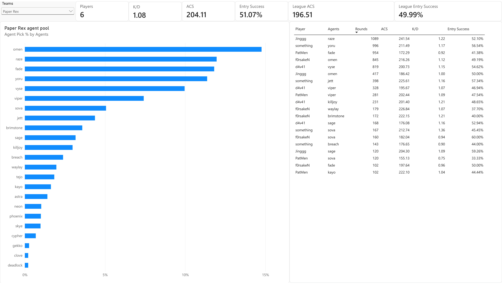

# VCT 2025 Player Analytics

An interactive Power BI dashboard analyzing professional VALORANT play across the 2025 VALORANT Champions Tour (VCT): which agents dominate the meta, which players perform best, and how teams build their compositions.

Built to practice the full analytics workflow: cleaning messy real-world data, modeling it, writing DAX measures, and designing reports a stakeholder can explore on their own.

## Data

- **Source:** [Valorant Champion Tour 2021–2026 Data](https://www.kaggle.com/datasets/ryanluong1/valorant-champion-tour-2021-2023-data) (Kaggle), 2025 player stats file
- **Scope:** 15 tournaments, from the four regional Kickoffs through Masters Bangkok, Masters Toronto and Champions 2025
- **Grain after cleaning:** one row per player, per agent, per match (9,805 rows, 313 players, 58 teams, 27 agents)

## Data cleaning

The raw file had three problems that would have produced wrong numbers if left in. The fixes are in [`clean_data.py`](clean_data.py) (Python, pandas), and the output is [`data/vct2025_players_clean.csv`](data/vct2025_players_clean.csv).

| Issue                                                                                                                                                                | Impact                                         | Fix                                                                                                                                                   |
| -------------------------------------------------------------------------------------------------------------------------------------------------------------------- | ---------------------------------------------- | ----------------------------------------------------------------------------------------------------------------------------------------------------- |
| **Rollup rows mixed with detail rows.** "All Stages" rows total a whole tournament, and multi-agent rows (e.g. `astra, omen`) total a player's agents for one match. | Every stat would be double- or triple-counted. | Removed both, cutting the file from 17,996 to 9,805 rows at a single consistent grain.                                                                |
| **Clutch records corrupted into dates.** About 6,200 values like `1/3` had been auto-converted to `03-Jan`.                                                          | Clutch stats unusable for a third of the data. | Decoded the month (wins) and day (attempts) back into two numeric columns. Validated against the reported Clutch Success %: 2,654 / 2,654 rows match. |
| **Percentages stored as text** (`"44%"`).                                                                                                                            | Can't aggregate or format.                     | Converted to decimals.                                                                                                                                |

## Data model and measures

Single fact table, plus an Agent → Role column (Duelist, Initiator, Controller, Sentinel) added in Power Query.

The measures recompute every rate from raw counts and never average the per-row averages. A player's ACS across 20 maps is weighted by rounds played, not a simple mean of 20 map-level ACS values.

| Measure                     | DAX logic                                                                                                  |
| --------------------------- | ---------------------------------------------------------------------------------------------------------- |
| Rounds                      | `SUM(Rounds Played)`                                                                                       |
| K/D                         | `Total Kills ÷ Deaths`                                                                                     |
| KPR                         | `Total Kills ÷ Rounds`                                                                                     |
| ACS                         | Round-weighted: `SUMX(ACS × Rounds) ÷ Rounds`                                                              |
| Entry Success               | `First Kills ÷ (First Kills + First Deaths)`                                                               |
| Clutch %                    | `Clutches Won ÷ Clutches Played`                                                                           |
| Agent Pick %                | Agent's rounds ÷ all rounds in the current filter context                                                  |
| Players, Agents Played      | `DISTINCTCOUNT` of each                                                                                    |
| Top Agent, Top Agent Pick % | The most-played agent (`TOPN` on rounds) and its pick rate, so the headline cards update with every filter |

## Report pages

1. **Agent Meta:** headline cards (players, agents played, top agent and its pick rate) and pick rate by agent, filterable by tournament
2. **Player Leaderboard:** a ranked table of ACS, K/D and entry success for players with 500+ rounds, and a scatter chart with a trend line comparing ACS against entry success
3. **Team Scouting:** pick a team to see its headline stats against the league average (ACS, entry success), its agent pool, and a roster table of each player's agents (100+ rounds)

## Key findings

- **Omen was the backbone of the 2025 meta.** He was played in about 13% of all player-rounds, ahead of Viper (8%) and Sova (8%). Omen was the most-played agent in every region and at international events.
- **The meta was remarkably uniform across regions.** Americas, EMEA, Pacific and China all shared the same top agents, with only EMEA swapping Viper for Cypher in its top three.
- **Some agents were nearly absent from pro play.** Reyna (0.1%), Phoenix (0.2%) and Clove (0.3%) barely appeared.
- **Duelists win their opening duels most often.** Duelists won 51.5% of the round-opening duels they took, compared with 47.1% for Initiators, which fits their role as the team's entry players.
- **Winning opening duels goes with overall impact.** Across the 211 players with 500+ rounds, entry success and ACS are strongly correlated (r ≈ 0.61).
- **There's more than one way to be elite.** Among the top 25 players by ACS, that correlation nearly disappears (r ≈ 0.09). ZmjjKK posted the highest ACS with below-average entry success, so he did his damage after the opening duel, while aspas and Kai were the best entry players.
- **Top performers (500+ rounds):** ZmjjKK (EDward Gaming) led all qualifying players in round-weighted ACS at 247. Kai (Trace Esports) and aspas (MIBR) had the best entry success, winning about 62% of their opening duels.

## Data limitations

- **No clutch data for China.** The source has no clutch statistics for any China league event, so Chinese players' clutch numbers come only from their few international matches. Clutch % is left out of player comparisons for that reason.
- **Rounds are player-rounds.** Each row counts a player's own rounds, so one real round appears once per player (10 times in total). Totals of the Rounds column overstate actual rounds played; pick rates and per-round stats are unaffected.
- **Minimum sample size.** The leaderboard only includes players with 500+ rounds, so players with a handful of standout maps don't distort the rankings.
- **Mid-season roster moves.** A player who changed teams appears once per team.

## Tools

Power BI (web): semantic model, DAX, reports · Python (pandas): data cleaning
